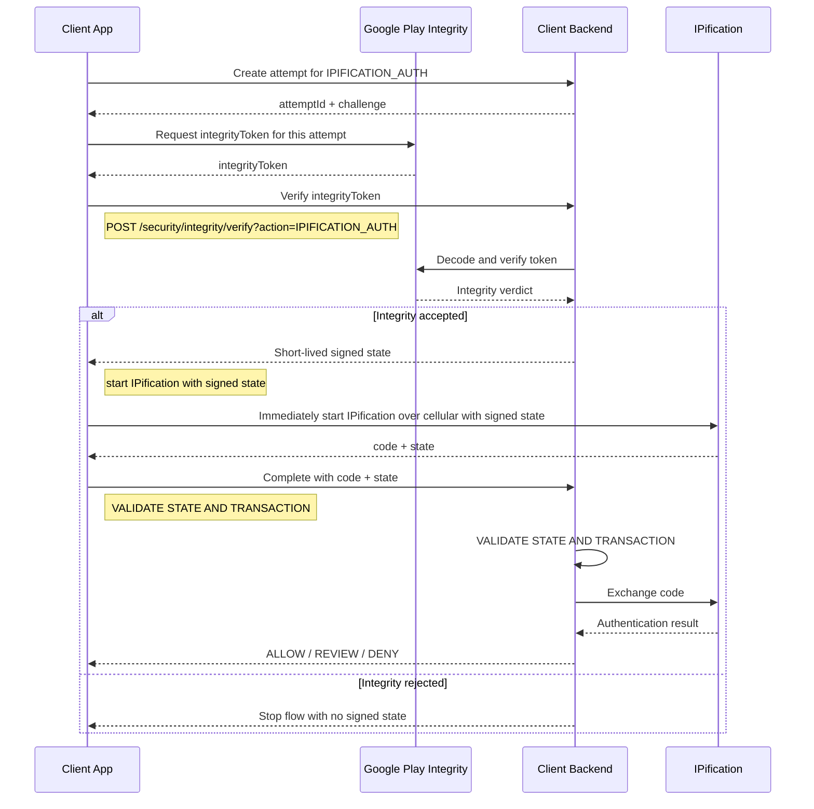

# Google Play Integrity with IPification

Use Google Play Integrity to check the Android app and device before starting an IPification verification.

For every new IPification attempt:

1. Request a fresh Play Integrity token.
2. Send it to the Client Backend.
3. If the integrity check passes, receive a short-lived signed `state`.
4. Pass that `state` to the IPification SDK using `setState()`, then immediately start authentication.
5. Send the returned `code` and `state` to the Client Backend for completion.

The Play Integrity token and signed `state` must not be reused for another attempt.

## Flow



## 1. Prepare Play Integrity

Prepare and reuse the Standard Integrity token provider. When the user starts IPification:

```http
POST /security/integrity/attempt?action=IPIFICATION_AUTH
```

The backend returns a short-lived attempt:

```json
{
  "attemptId": "<attempt-id>",
  "challenge": "<random-challenge>"
}
```

Create a hash bound to the attempt:

```text
requestHash = SHA-256(action + attemptId + challenge + operationData)
```

Request a fresh Play Integrity token:

```kotlin
integrityTokenProvider.request(
  StandardIntegrityTokenRequest.builder()
    .setRequestHash(requestHash)
    .build()
)
```

The backend stores the same attempt data to verify `requestHash`. Do not reuse the attempt or token. See Google's [Standard API guide](https://developer.android.com/google/play/integrity/standard).

## 2. Verify integrity and request signed state

The app calls a shared Client Backend API immediately before starting IPification:

```http
POST /security/integrity/verify?action=IPIFICATION_AUTH
Content-Type: application/json

{
  "attemptId": "<attempt-id>",
  "integrityToken": "<play-integrity-token>"
}
```

The backend must:

- Confirm that the attempt belongs to the current session and has not expired.
- Confirm that `action` matches the action stored for the attempt.
- Decode the token through Google Play Integrity.
- Validate the package name, `requestHash`, timestamp, app verdict, and device verdict.
- Create a single-use verification transaction.
- Generate a short-lived signed `state` only when the integrity policy passes.

Example success response:

```json
{
  "state": "<backend-signed-state>",
  "expiresAt": "<UTC-expiry-time>"
}
```

The app must pass the returned `state` to the IPification SDK using `setState()`, then immediately start authentication. If the state expires, start again with a new attempt and a new integrity token.

## 3. Complete Verification and Exchange the IPification Code

IPification returns the authorization `code` and the same `state`. The app sends both to its backend in the original session:

```http
POST /ipification/token-exchange
Content-Type: application/json

{
  "code": "<authorization-code>",
  "state": "<returned-state>"
}
```

The backend must **validate the state and transaction**:

- Verify the state signature, expiry, action, and session.
- Confirm that Play Integrity passed for this transaction.
- Reject expired, changed, or previously used transactions.
- Exchange the code with IPification using backend credentials.
- Apply the client's security policy and return **ALLOW / REVIEW / DENY**.

## Using the shared integrity API for other actions

The same `/security/integrity/verify` endpoint can protect other sensitive actions:

```http
POST /security/integrity/verify?action=ACCOUNT_RECOVERY
Content-Type: application/json

{
  "attemptId": "<attempt-id>",
  "integrityToken": "<play-integrity-token>"
}
```

Each action must have its own backend policy. The backend must use the action stored with the attempt, so the app cannot select a weaker policy by changing the request.

Reuse the endpoint and prepared token provider. Do not reuse an integrity token, signed state, or approval across different attempts or actions.

## Security rules

- Keep all credentials, secrets, signing keys, and state generation on the backend.
- Bind the integrity check and IPification flow to the same session and attempt.
- Make every token and signed state short-lived and single-use.
- Never log integrity tokens, authorization codes, or signed state.

Google references: [setup](https://developer.android.com/google/play/integrity/setup) and [integrity verdicts](https://developer.android.com/google/play/integrity/verdicts).
